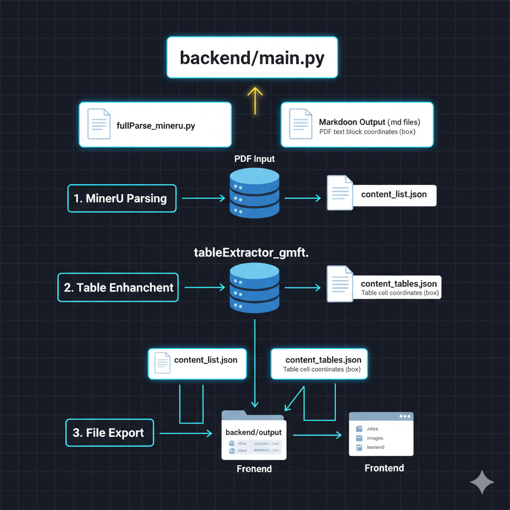
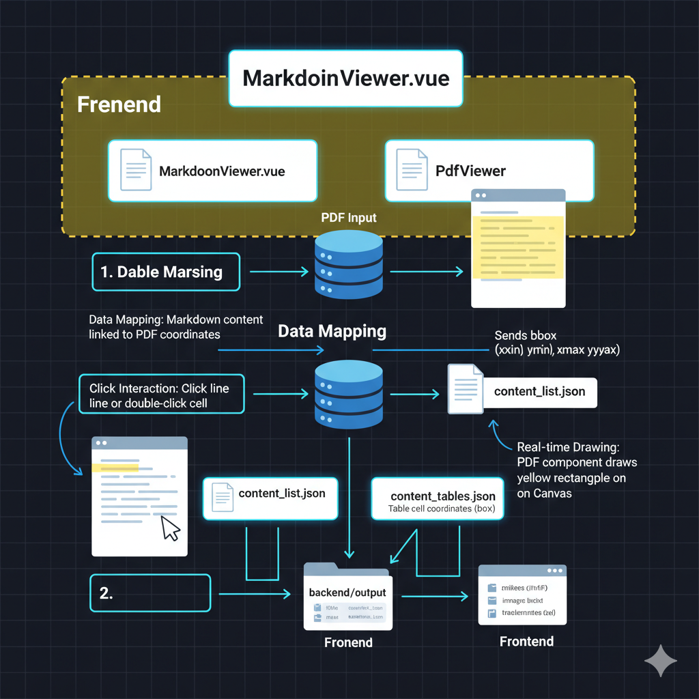

# MinerPick ⚒️

[English](#english) | [中文](#chinese)

---

<a name="english"></a>
## English

**MinerPick** is an intelligent PDF-to-Markdown conversion platform that provides a high-fidelity "mirror" experience. It doesn't just convert text; it bridges the visual gap between your original document and its digital structure.


### 🌟 Key Features

- **High-Fidelity Conversion**: Powered by **MinerU**, the world-class PDF parsing engine, ensuring accurate extraction of complex layouts, formulas, and tables.
- **Interactive Synchronization**: Click any element in the Markdown (tables, paragraphs) to instantly highlight and scroll to its original position in the PDF.
- **Dual-Pane View**: Side-by-side comparison with synchronized scrolling and page tracking.
- **Smart Table Extraction**: Integrated with **GMFT** (Grid-based Model for Table Extraction) for precise cell-level data recovery.
- **Developer-First**: Clean FastAPI backend, modular parser architecture, and Vue 3 + Ant Design Vue 4 frontend.
- **Security & Flexibility**: Support for `.env` configurations and user-defined API settings via the frontend.

### 🚀 Tech Stack

- **Frontend**: Vue 3, Vite, TypeScript, Ant Design Vue 4, Vue-i18n.
- **Backend**: FastAPI, Pydantic v2, PyMuPDF.
- **Parsing Engine**: MinerU API (v2.6.4) / Local Parsers.

### 🛠️ Architecture

#### 1. Backend Parsing Flow
<p align="center">
  
</p>

*The core logic involves MinerU for initial parsing and GMFT for high-precision table cell extraction.*

#### 2. Frontend Highlight Sync
<p align="center">
  
</p>

*Markdown blocks are mapped to PDF coordinates (bbox) via `md_index`, allowing real-time synchronized highlighting.*

### 🛠️ Getting Started

#### 1. Prerequisites
- Python 3.9+
- Node.js 18+

#### 2. Backend Setup
```bash
cd backend
pip install -r requirements.txt
cp ../.env.example ../.env  # Configure your MinerU API Key in .env
python main.py
```

#### 3. Frontend Setup
```bash
cd frontend
npm install
npm run dev
```

### 🔌 API Documentation

The backend provides a set of RESTful APIs that can be used independently of the frontend.

- **Upload PDF**
  - **Endpoint**: `POST /api/upload`
  - **Body**: `multipart/form-data` with `file` field.
  - **Response**: `{"task_id": "...", "filename": "...", "pdf_url": "..."}`

- **Convert PDF**
  - **Endpoint**: `POST /api/convert`
  - **Body**: `application/json`
    ```json
    {
      "task_id": "uuid",
      "filename": "original.pdf",
      "provider": "mineru" | "pymupdf",
      "mineru_api_url": "optional_override",
      "mineru_api_key": "optional_override"
    }
    ```
  - **Response**: `{"task_id": "...", "provider": "...", "md_url": "...", "content_list_url": "...", "content_tables_url": "..."}`

- **Get Results**
  - Result files are accessible at `/results/{task_id}/{filename}`.

### 🤝 Acknowledgments
This project is powered by **MinerU** and **gmft**. Special thanks to the open-source community for these incredible tools.

### 📄 License
This project is licensed under the MIT License - see the [LICENSE](LICENSE) file for details.

---

<a name="chinese"></a>
## 中文

**MinerPick** 是一款智能 PDF 转 Markdown 平台，提供高保真的“镜像”体验。它不仅是文字的转换，更是在原始文档与其数字化结构之间搭建了一座视觉桥梁。

### 🌟 核心特性

- **高保真转换**: 由 **MinerU** 提供动力，这是世界顶级的 PDF 解析引擎，确保复杂布局、公式和表格的准确提取。
- **交互式同步**: 点击 Markdown 中的任何元素（如表格单元格、段落），即可在 PDF 中瞬间高亮并滚动到其原始位置。
- **双栏视图**: 左右对比视图，支持同步滚动和页面追踪。
- **智能表格提取**: 集成 **GMFT** (基于网格的表格提取模型)，实现精确到单元格的数据恢复。
- **开发者友好**: 简洁的 FastAPI 后端，模块化的解析器架构，以及 Vue 3 + Ant Design Vue 4 前端。
- **安全与灵活**: 支持 `.env` 环境配置，并允许用户通过前端界面自定义 API 设置。

### 🚀 技术栈

- **前端**: Vue 3, Vite, TypeScript, Ant Design Vue 4, Vue-i18n.
- **后端**: FastAPI, Pydantic v2, PyMuPDF.
- **解析引擎**: MinerU API (v2.6.4) / 本地解析器.

### 🛠️ 技术架构

#### 1. 后端解析流程
<p align="center">
  
</p>

*核心逻辑：使用 MinerU 进行基础解析，并集成 GMFT 模型实现高精度表格单元格坐标提取。*

#### 2. 前端高亮同步原理
<p align="center">
  
</p>

*Markdown 块通过 `md_index` 与 PDF 坐标（bbox）建立映射，实现实时的交互式高亮对齐。*

### 🛠️ 快速入门

#### 1. 环境要求
- Python 3.9+
- Node.js 18+

#### 2. 后端设置
```bash
cd backend
pip install -r requirements.txt
cp ../.env.example ../.env  # 在 .env 中配置您的 MinerU API Key
python main.py
```

#### 3. 前端设置
```bash
cd frontend
npm install
npm run dev
```

### 🔌 API 文档

后端提供了一套 RESTful API，可以脱离前端独立调用。

- **上传 PDF**
  - **接口**: `POST /api/upload`
  - **参数**: `multipart/form-data` 表单，包含 `file` 字段。
  - **返回**: `{"task_id": "...", "filename": "...", "pdf_url": "..."}`

- **转换 PDF**
  - **接口**: `POST /api/convert`
  - **参数**: `application/json`
    ```json
    {
      "task_id": "uuid",
      "filename": "original.pdf",
      "provider": "mineru" | "pymupdf",
      "mineru_api_url": "可选覆盖地址",
      "mineru_api_key": "可选覆盖密钥"
    }
    ```
  - **返回**: `{"task_id": "...", "provider": "...", "md_url": "...", "content_list_url": "...", "content_tables_url": "..."}`

- **获取结果**
  - 转换后的文件可通过 `/results/{task_id}/{filename}` 访问。

### 🤝 致谢
本项目由 **MinerU** 和 **gmft** 提供动力。特别感谢开源社区提供的这些出色工具。

### 📄 开源协议
本项目采用 MIT 协议 - 详情请参阅 [LICENSE](LICENSE) 文件。
