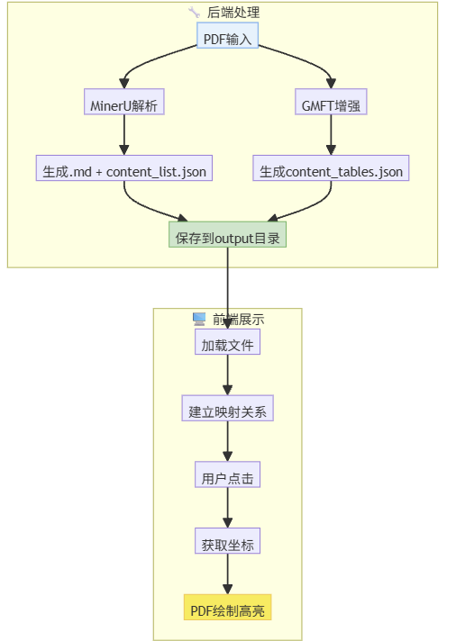

# MinerPick ⚒️

[English](#english) | [中文](#chinese)

---
<p align="center">
  
</p>

<a name="english"></a>
## English

**One-liner**: A full-stack PDF ↔ Markdown “mirror” with pixel-level highlighting and editable table cells, designed for LLM workflows.

### 🛠️ Architecture

#### 1) Data Pipeline (Backend)
- **PDF Upload**: `main.py` -> `input/`
- **Parsing**: `MinerUParser` (API) -> `content.md` + `content_list.json`- **Table Enrichment**: `GMFTTableExtractor` (`gmft`) -> `content_tables.json` (Cell-level coords)
- **Mapping**: `_build_md_first_content_list` maps MD blocks to PDF bboxes.

<p align="center">
  
</p>

#### 2) Interaction Flow (Frontend)
- **Rendering**: `MarkdownViewer.vue` (MD) + `PdfViewer.vue` (PDF)
- **Sync**: Hover/Click index -> Lookup JSON -> Emit coordinates -> Render Highlight box.

<p align="center">
  
</p>

### 🆚 Comparison (Why MinerPick?)

MinerPick is not just another PDF parser; it is a **human-in-the-loop workflow** designed to bridge the gap between raw parsing and high-quality LLM data.

| Dimension | **MinerPick (Ours)** | MinerU (Magic-PDF) | Marker | Docling | Unstructured |
|---|---|---|---|---|---|
| **Category** | 🛠️ **Interactive Workflow** | 🏗️ Core Parser | 🏗️ Core Parser | 🏗️ Core Parser | 🏗️ Data Pipeline |
| **Visual Sync** | ✅ **Bi-directional** <br>*(Click MD to locate PDF)* | ⚠️ JSON Only <br>*(No UI provided)* | ❌ None <br>*(Text-only output)* | ⚠️ JSON Only <br>*(No UI provided)* | ⚠️ Bbox Only <br>*(Elements only)* |
| **Table Precision**| ✅ **Cell-level Mapping** <br>*(via gmft enrichment)* | ⚠️ Block-level <br>*(HTML/MD structure)* | ❌ Low <br>*(Plain MD table)* | ⚠️ High <br>*(Structured HTML)* | ⚠️ Medium <br>*(Regional bbox)* |
| **Human-in-loop** | ✅ **Editable UI** <br>*(Fix errors on the fly)* | ❌ No | ❌ No | ❌ No | ❌ No |
| **Verification** | ✅ **Side-by-side** <br>*(Pixel-level verification)* | ❌ No | ❌ No | ❌ No | ❌ No |
| **Deployment** | ✅ **Full-stack (FastAPI)** | ⚠️ CLI / SDK | ❌ CLI Only | ⚠️ Python SDK | ✅ API / SaaS |

---

### 🧪 Cases (Coming soon)

- Case studies: **TBD (to be published)**.

### 🌐 Online Demo

- Online demo: **http://124.221.238.70:8005/**.

### ▶️ Usage

#### 1) Prerequisites
- Python 3.10+
- Node.js 18+

#### 2) Backend
```bash
pip install -r requirements.txt
cp .env.example .env
python backend/main.py
```

#### 3) Frontend
```bash
cd frontend
npm install
npm run dev
```

#### Notes
- Built on MinerU and gmft.

---

<a name="chinese"></a>
## 中文


**一句话描述**：面向 LLM 的全栈 PDF ↔ Markdown “镜像”工具，支持像素级高亮对齐与表格单元格编辑。

### 🛠️ 技术架构

#### 1) 数据处理流程 (后端)
- **PDF 上传**: `main.py` -> 存储至 `input/`
- **内容解析**: `MinerUParser` (调用 API) -> 生成 `content.md` + `content_list.json`
- **表格增强**: `GMFTTableExtractor` (`gmft`) -> 提取单元格级坐标 `content_tables.json`
- **对齐映射**: `_build_md_first_content_list` 算法将 MD 区块与 PDF 坐标进行关联。

#### 2) 同步高亮交互 (前端)
- **双端渲染**: `MarkdownViewer.vue` (渲染 MD) + `PdfViewer.vue` (渲染 PDF)
- **交互对齐**: 悬停/点击索引 -> 查询 JSON 映射 -> 发送坐标 -> 在 PDF 上层绘制高亮框。

<p align="center">
  
</p>


### 🆚 同类产品对比（为什么选择 MinerPick？）

MinerPick 不仅仅是一个 PDF 解析器，它是一个**人机协同（Human-in-the-loop）的工作流**，旨在解决原始解析数据与高质量 LLM 数据之间的“最后一公里”问题。

| 维度 | **MinerPick (本项目)** | MinerU (Magic-PDF) | Marker | Docling | Unstructured |
|---|---|---|---|---|---|
| **产品定位** | 🛠️ **交互式工作流** | 🏗️ 核心解析引擎 | 🏗️ 核心解析引擎 | 🏗️ 核心解析引擎 | 🏗️ 数据流水线 |
| **视觉同步** | ✅ **双向同步** <br>*(点击 MD 定位 PDF)* | ⚠️ 仅 JSON <br>*(无原生 UI)* | ❌ 无 <br>*(仅纯文本输出)* | ⚠️ 仅 JSON <br>*(无原生 UI)* | ⚠️ 仅 Bbox <br>*(元素级)* |
| **表格精度**| ✅ **单元格级映射** <br>*(通过 gmft 增强)* | ⚠️ 结构级 <br>*(HTML/MD 结构)* | ❌ 低 <br>*(纯 MD 表格)* | ⚠️ 高 <br>*(结构化 HTML)* | ⚠️ 中 <br>*(区域级 Bbox)* |
| **人机协同** | ✅ **可编辑 UI** <br>*(即时修正解析错误)* | ❌ 否 | ❌ 否 | ❌ 否 | ❌ 否 |
| **验证能力** | ✅ **像素级对齐** <br>*(双栏对照验证)* | ❌ 否 | ❌ 否 | ❌ 否 | ❌ 否 |
| **部署方式** | ✅ **全栈服务 (FastAPI)** | ⚠️ CLI / SDK | ❌ 仅 CLI | ⚠️ Python SDK | ✅ API / SaaS |

---

### 🧪 案例（待发布）

- 案例集：**待发布**。

### 🌐 在线体验地址

- 在线体验：**http://124.221.238.70:8005/**。

### ▶️ 使用方法

#### 1）环境要求
- Python 3.10+
- Node.js 18+

#### 2）启动后端
```bash
pip install -r requirements.txt
cp .env.example .env
python backend/main.py
```

#### 3）启动前端
```bash
cd frontend
npm install
npm run dev
```

#### 说明
- 本项目基于 MinerU 和 gmft 开发。

### 📄 License

MIT License. See [LICENSE](LICENSE).
